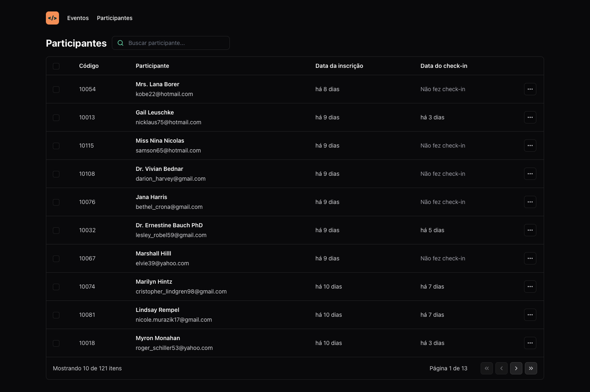

<p align="center">
  
</p>

<br />

<p align="center">
  
  
</p>

[](https://github.com/lzhudson)
[](#)
[](https://github.com/lzhudson/pass.in/stargazers)
[](https://github.com/lzhudson/pass.in/network/members)
[](https://github.com/lzhudson/pass.in/graphs/contributors)

# :pushpin: Table of Contents

* [Features](#rocket-features)
* [Installation](#construction_worker-installation)
* [Found a bug? Missing a specific feature?](#bug-issues)
* [Contributing](#tada-contributing)
* [License](#closed_book-license)

# :rocket: Features

* Integrate with API in Node.js
* Search by attendee
* Pagination
* Set URL statements with query params

# :construction_worker: Installation

## Configure back-end

**You need to install [Node.js](https://nodejs.org/en/download/) and then, to clone the project via HTTPS, run this command:**

```
git clone https://github.com/rocketseat-education/nlw-unite-nodejs.git
```

SSH URLs provide access to a Git repository via SSH, a secure protocol. If you have a SSH key registered in your Github account, clone the project using this command:

```
git clone git@github.com:rocketseat-education/nlw-unite-nodejs.git
```


**Install dependencies**

```
npm i
```

**Create the .env file with the following content**
```env
DATABASE_URL="file:./dev.db"
```

**Populate the database with the command**
```bash
npx prisma db seed
```

**Start development server**
```bash
npm run dev
```

## Configure front-end

**You need to install [Node.js] (https://nodejs.org/en/download/) and then, to clone the project via HTTPS, run this command:**

```
git clone https://github.com/lzhudson/pass.in.git
```

SSH URLs provide access to a Git repository via SSH, a secure protocol. If you have a SSH key registered in your Github account, clone the project using this command:

```
git clone git@github.com:lzhudson/pass.in.git
```

**Install dependencies**

```
npm i
```

**Start development server**

```
npm run dev
```

# :bug: Issues

Feel free to **file a new issue** with a respective title and description on the [pass.in](https://github.com/lzhudson/pass.in/issues) repository. If you already found a solution to your problem, **I would love to review your pull request**! Have a look at our [contribution guidelines](https://github.com/lzhudson/pass.in/blob/main/CONTRIBUTING.md) to find out about the coding standards.

# :tada: Contributing

Check out the [contributing](https://github.com/lzhudson/pass.in/blob/main/CONTRIBUTING.md) page to see the best places to file issues, start discussions and begin contributing.

# :closed_book: License

Released in 2024
This project is under the [MIT license](https://github.com/lzhudson/pass.in/blob/main/LICENSE).

Designed by [Rockeseat](https://github.com/Rocketseat) and developed by [Hudson Holanda](https://github.com/lzhudson) 🖤🚀